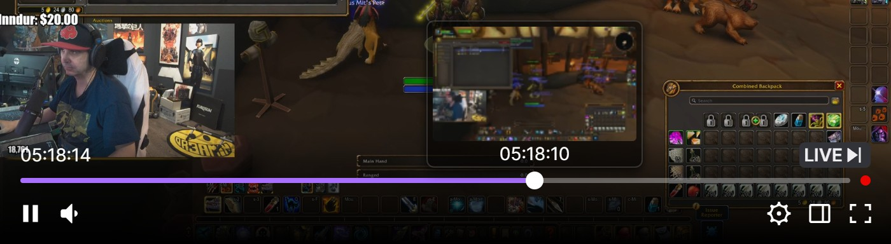

  

<h1 align="center">Twitch Rewind</h1>

  <strong>Rewind any live Twitch stream and unlock sub-only VODs.</strong> 
  A lightweight extension for Chrome/Chromium and Firefox that adds the same seekbar as Twitch's own rewind to every live stream — plus frame previews Twitch doesn't have — and plays subscriber-only VODs, no subscription needed.

  

## Features

- **The same seekbar as Twitch's own rewind** — Twitch keeps its rewind for Turbo users and some subscribers, on Affiliate and Partner channels only; this brings the same bar to any live stream that saves its VODs, small channels included, down to the colors, thumb, time balloon and LIVE badge
- **Previews Twitch doesn't have** — Twitch's bar only shows a time; hover this one to see the frame at that moment (one every 2 seconds), and click to rewind to exactly that frame
- **Sub-only VODs** — watch subscriber-only VODs without subscribing

## Installation

> Not on any store yet — install it manually:

Download the repository: **Code → Download ZIP** on [GitHub](https://github.com/Alban1911/TwitchRewind) (or `git clone`), then unzip it.

### Chrome / Chromium

1. Open `chrome://extensions`
2. Enable **Developer mode** (top-right toggle)
3. Click **Load unpacked** and select the `TwitchRewind` folder

### Firefox

Requires Firefox 128 or later. Firefox only keeps signed add-ons installed, and Twitch Rewind isn't signed yet, so load it as a temporary add-on:

1. Open `about:debugging#/runtime/this-firefox`
2. Click **Load Temporary Add-on…** and select the `manifest.json` file in the `TwitchRewind` folder

Temporary add-ons are removed when Firefox closes, so repeat these steps after a restart. Firefox Developer Edition, Nightly and ESR can keep it installed instead: set `xpinstall.signatures.required` to `false` in `about:config`, zip the *contents* of the `TwitchRewind` folder (`manifest.json` at the root of the archive), rename the zip to `.xpi` and open it in Firefox.

## Usage

1. Open any **live** Twitch channel
2. A seekbar and a **LIVE** badge appear in the player controls, with the look of Twitch's own rewind
3. **Hover the seekbar** to preview any moment of the stream (a frame every 2 seconds), then **click or drag** to rewind — the channel's VOD plays from exactly the frame you saw
4. Click **LIVE ⏭** (or the red dot at the end of the seekbar) to jump back to the live edge

While rewinding:

| Key | Action |
|---|---|
| `Space` / `K` | Play / Pause |
| `←` / `→` | Seek 10s back / forward |
| `M` | Mute / Unmute |
| `,` / `.` | Slower / faster playback |

Volume, quality, and play/pause keep working through Twitch's native controls the whole time.

## Good to know

- The streamer must have VOD saving enabled — otherwise there's nothing to rewind
- You can seek up to ~15 seconds behind the live edge (recent VOD segments take a moment to become available)
- Seekbar previews download a single frame for the spot you hover (streams have one every 2 seconds) — tens of KB, or a few hundred KB on channels without transcodes — and are cached
- Where Twitch shows you its own rewind (on Affiliate and Partner channels, with Turbo, or as a subscriber when the channel gives subscribers ad-free viewing), the extension steps aside and leaves you Twitch's seekbar
- No tracking, no analytics

## Credits

The sub-only VOD unlock is inspired by [TwitchNoSub](https://github.com/besuper/TwitchNoSub) by [@besuper](https://github.com/besuper).

## License

[MIT](LICENSE)
